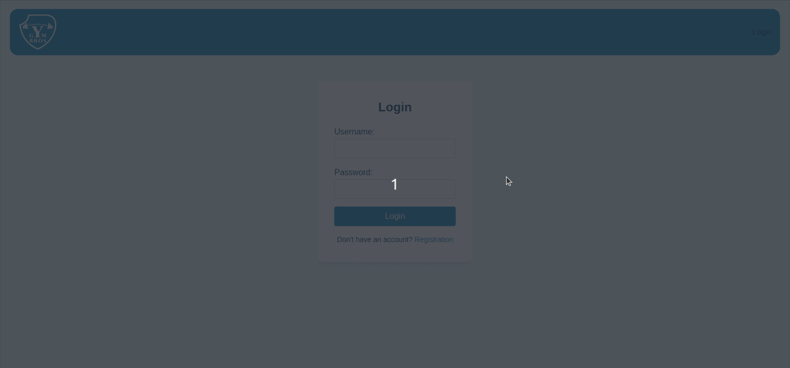

## Задача: разработать онлайн-магазин товаров с предиктивной аналитикой

### Описание задачи
Онлайн-магазины все любят. Для того чтобы там покупать, никуда ходить не надо – лишь бы деньги и желание купить было. 

Продавцу хочется:
- знать продуктовую воронку,
- понимать, насколько перспективен продукт,
- прогнозировать, за сколько его продавать,
- рассчитывать, какой доход он сможет получить.

Покупателю важно:
- купить то, что ему полезно и соответствует потребностям.

**Ваша задача**: разработать систему онлайн-магазина с предиктивным функционалом, продуктовыми корзинами и рекомендациями для пользователей. Также предоставьте пользователям возможность:
- покупать продукцию,
- получать чеки.

**Дополнительно**:
- Подумайте, какие признаки поспособствуют лучшей предиктивной способности вашей модели.
- Реализуйте процесс сбора данных.
- Оптимизируйте модель для наилучших результатов.

---

## Admin demo

## User demo

## Recommendation demo

---

# Участники проекта

Над проектом работали студенты учебной группы **М8О-109СВ-24**:

## ML
- [Сорокин Никита](https://github.com/iameteron)

## Backend
- [Ефанов Кирилл](https://github.com/Fara-light)
- [Панкин Андрей](https://github.com/W0ndik)

## Frontend
- [Бутаков Георгий](...)
- [Дрёмов Александр](https://github.com/Sleenjep)

---

## [Презентация](PRESENTATION.pdf) к проекту

---

## Инструкция по запуску

docker compose -f docker_compose.yml up -d --build

Swagger:
    "http://localhost:8000/docs/"

Frontend:
    "http://localhost:8080/"
